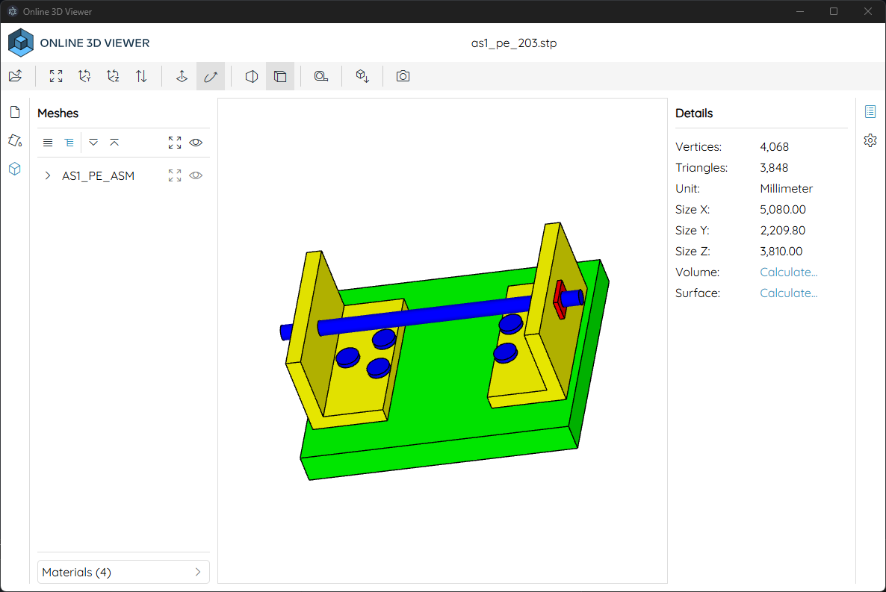

# Offline3DViewer
Online3DViewer with Electron

## Useage

Download from release , Unzip and run.

## Developer

1. Download source code in [Online3DViewer-009e3cb](https://github.com/kovacsv/Online3DViewer/tree/009e3cbfc3c2eb72b8e0ee41c9a4ea4c81b69370) and unzip it.

2. `npm install` for install dep, and `npm start` for test.

3. modify code, disable cookie dialog, set default settings...etc.

4. copy assets, build folder( merge `website/assets` and `assets`) to rootfolder.

5. download some cdn js and wasm to undefined\loaders\ (It's magic)

6. modify index.html, remove "../" for line 16 and 17.

7. add main.js and package.json

8. npm install and npm start

9. package use electron-builder
